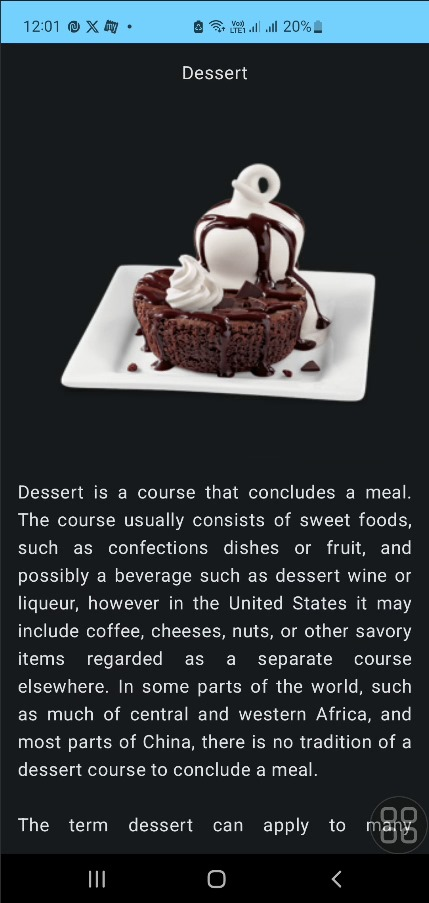

# 🚀 🍽️ RecipeApp – Your Personalized Culinary Explorer (Android)

> _“From Beef to Dessert – Discover & cook effortlessly.”_

**RecipeApp** is a modern Android application that lets users explore recipe categories from around the world using TheMealDB API. It features a declarative Jetpack Compose UI, modern MVVM architecture, and seamless real-time data integration.

---

## ✨ Features

- 🍛 **Category-based Recipe Discovery** – Beef, Chicken, Dessert, Pasta, Seafood & more  
- ⚙️ **Jetpack Compose UI** – Built with Material Design 3 for intuitive UX  
- 🌐 **Live API Integration** – Powered by Retrofit & TheMealDB  
- 🧠 **MVVM Architecture** – Clean, testable & scalable design  
- 🔄 **Asynchronous Networking** – Coroutines & suspend functions for performance  
- 📶 **Connectivity Handling** – Internet permission & fail-safe try-catch blocks  
- 📱 **Optimized for All Devices** – Supports Android 5.0+ with responsive layouts  

---

## 🧱 Tech Stack

| Category         | Technology Used                         |
|------------------|------------------------------------------|
| **Language**     | Kotlin                                   |
| **UI**           | Jetpack Compose, Material Design 3       |
| **Architecture** | MVVM + Repository Pattern                |
| **Networking**   | Retrofit2, Gson Converter                |
| **Async Ops**    | Kotlin Coroutines, Suspend Functions     |
| **State Mgmt**   | ViewModel, StateFlow                     |
| **Data Source**  | [TheMealDB API](https://www.themealdb.com/api.php) |

---

## 📸 Screenshots

<div align="center">
  
  
</div>


 **App demo in `/AppDemo`**

---

## 🛠️ Setup Instructions

1. Clone the repository  
   ```bash
   git clone https://github.com/Aditya-dev2005/RecipeApp.git
Open the project in Android Studio

Run the app (ensure internet permission is granted in AndroidManifest.xml)

 ---

🚧 Future Enhancements: 

🔍 Search Functionality by name/ingredient

❤️ Favorites System for offline viewing

🤖 Smart Suggestions via ML integration

🌐 Localization Support for global audience


## 👤 Author

Aditya Chaturvedi

GitHub :  https://github.com/Aditya-dev2005

LinkedIn : https://www.linkedin.com/in/aditya-chaturvedi-8b7776302/
